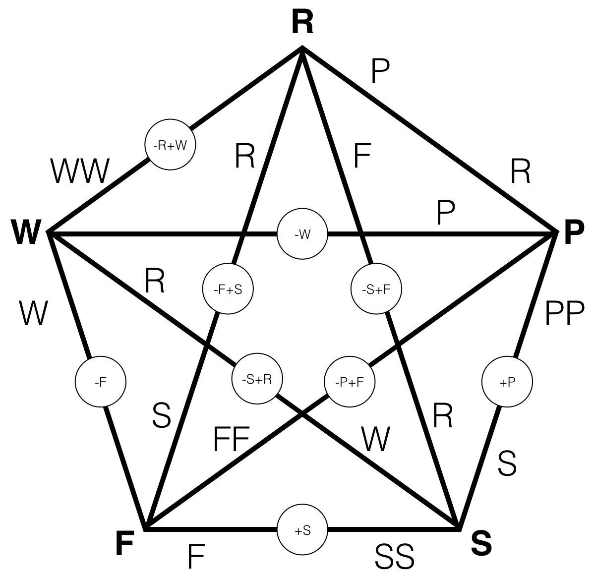

# rock-paper-stuff

Rock Paper Stuff

By Lee Spector

## About

Rock Paper Stuff is a game designed for artificial intelligence experiments and education. 

The game itself is intended to be played by computer players, each of which aims to earn the highest score.

The goal for students and researchers is to develop computer players that win games and tournaments.

## The Game

Any number of players can play.

Players are paired randomly for trades, one pair at a time. Sometimes the trades cause some of the traded things to be lost or other things to be created (details below).

For each trade, each player plays one of: Rock, Paper, Scissors, Fire, Water. 

Players start with as many of each of these as there are players. For example, if there are four players, then each player begins with four Rock, four Paper, four Scissors, four Fire, and four Water.

Players can play something even if they don't have it, but then they go into debt on that item.

A player's score is the amount of Water that it has at the end of the game, minus all of its debts. Each unit of debt costs one unit of Water in the final score tally, regardless of what it is a debt for.

The number of trades in a game is the number of possible pairings times 100. For a two-player game, this is 100 trades. For a three-player game, 300 trades. For a four-player game, 600 trades. In general, the number of trades is *100n(n-1)/2* where *n* is the number of players.

Although players can't see what each other are going to play before they choose their own play (it's as if they must choose simultaneously), they *can* see each other's names, inventories, and anything else that a player has chosen to display on its "skin" (which could include promises to behave in a certain way, or information about other players, etc.). Players can also remember whatever they want to record from trade to trade, and they can access a complete history of the trades in which they've participated.

### Trades

- If A plays Rock and B plays Scissors, then A gets Scissors and Fire, and B gets Rock (Rock sparks fire from Scissors)

- If A plays Rock and B plays Fire, then A gets Fire and B gets Scissors (Fire forges Rock into Scissors)

- If A plays Rock and B plays Water, then A gets nothing and B gets two Water (Rock sinks and splashes back Water)

- If A plays Paper and B plays Scissors, then A gets Scissors and B gets two Paper (Scissors cuts paper into two)

- If A plays Paper and B plays Fire, then A gets Fire and B gets Fire (Fire lights Paper)

- If A plays Paper and B plays Water, then A gets Paper and Water and B gets Nothing (Paper absorbs Water)

- If A plays Scissors and B plays Water, then A gets Water and B gets Rock (Water rusts Scissors into Rock)

- If A plays Fire and B plays Water, then A gets nothing and B gets two Water (Water extinguishes Fire)

For all other trades, the played items are simply exchanged.

These rules are summarized in the following diagram, in which the circled abbreviations show the overall loss/gain to the ecosystem resulting from the specific trade:

## Playing

You can see what it looks like to run the game in [this saved Gorilla REPL worksheet](http://viewer.gorilla-repl.org/view.html?source=github&user=lspector&repo=rock-paper-stuff&path=src/rock_paper_stuff/worksheet.clj).

The code for Rock Paper Stuff is written in [Clojure](http://clojure.org), and intended to be run in a [Gorilla REPL](http://gorilla-repl.org) worksheet or from the command line, in either case using the [Leiningen](https://leiningen.org) tool for Clojure project management. The instructions here assume that you have some familiarity with Clojure programming and with your computer's command line interface (terminal).

To play Rock Paper Stuff, download the project folder and then use the terminal to navigate into the project directory.

You can then type `lein gorilla`, and point your browser at the URL that it prints (after a few seconds).

This will open a fresh worksheet, which you could work in and save... **But** the first time you do this, you should instead use the menu (upper right), select "Load a worksheet," and load `src/rock-paper-stuff/worksheet.clj.` 

You'll see the evaluated worksheet, and you can click into any code cell and press `control-enter` to evaluate it again (possibly after changing it). This worksheet will walk you through basic interactions with the Rock Paper Stuff environment.

To run games and tournaments from the terminal, put your code in `user.clj` in the indicated places. Then typing `lein run` at the operating system command line will run that function and print the result to the terminal.

## Acknowledgments

Based on ideas from conversations with members of the [Hampshire College Computational Intelligence Lab](http://sites.hampshire.edu/ci-lab/) and:

- Clifford Bohm
- Ira Fay
- Jim Kan
- Joshua Newman
- Charles Ofria
- Anya Spector

This material is based upon work supported by the National Science Foundation under Grants No. 1617087, 1129139 and 1331283. Any opinions, findings, and conclusions or recommendations expressed in this publication are those of the authors and do not necessarily reflect the views of the National Science Foundation.